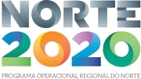
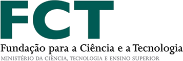
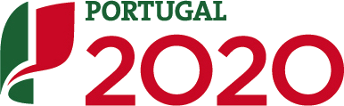

<!--
# Welcome to FACS 2023!

The 19th International Conference on Formal Aspects of Component Software will
take place on 19-20 October 2023. FACS 2023 will be an online conference.
 -->

<!-- # We are online! -->

<!-- See the program here: [Thursday](../2022/program/#thu), [Friday](../2022/program/#fri) -->

<!-- Zoom link for the presentations: [https://uio.zoom.us/j/64897891096?pwd=a2RzakgzMlFMWmJHVGRUcDVJNXY3UT09](https://uio.zoom.us/j/64897891096?pwd=a2RzakgzMlFMWmJHVGRUcDVJNXY3UT09){:target="_blank"} -->

<!-- Coffee breaks at wonder.me: [https://app.wonder.me/?spaceId=5076bfe7-29fe-45d9-b0f7-310381f4772a](https://app.wonder.me/?spaceId=5076bfe7-29fe-45d9-b0f7-310381f4772a){:target="_blank"} -->

# About FACS

The Formal Aspects of Component Software (FACS) conference series targets
research in formal approaches for distributed components and services. The
conferences cover topics including models, languages, analysis and
verification techniques for component-based systems such as service-oriented
architecture, cloud and edge computing, safety-critical, hybrid and cyber
physical systems, etc.

The 19th edition of FACS will take place online on October 19-20 2023.

### (14/10/23) Paper preprints published

The preprints of accepted papers at FACS 2023 have been published. Preprints are linked from the paper titles included in every session of the program.

### (30/9/23) Tentative Program and Registration Published

The tentative program for FACS 2023 has been published. To participate in the event, please fill the [following form](https://forms.gle/HB7kKSuK1tHxGVEP9). Participation is free of charge.

### (4/7/23) Deadline extended!

The deadline for abstracts and paper submissions has been extended to  July 17th, 2023.

### Proceedings and Special Issue

- Proceedings will be published at Springer's [Lecture Notes in Computer Science](https://www.springer.com/series/558){:target="_blank"}.
- A selection of the best papers of the conference will be invited to submit to a special issue of [Science of Computer Programming](https://www.sciencedirect.com/journal/science-of-computer-programming){:target="_blank"}.
<!-- The proceedings are online at
[https://link.springer.com/book/10.1007/978-3-031-20872-0](https://link.springer.com/book/10.1007/978-3-031-20872-0){:target="_blank"}{:rel="noopener"}.
-->

### Invited Speakers

  - [Marsha Chechik](https://www.cs.toronto.edu/~chechik/), University of Toronto, Canada
 - [Rajeev Alur](https://www.cis.upenn.edu/~alur/), UPenn, USA

### Past Editions
- [FACS 2022](https://facs-conference.github.io/2022/){:target="_blank"}, Oslo, Norway (online), November 10-11, 2022
- [FACS 2021](https://facs2021.inria.fr/){:target="_blank"}, Grenoble, France (online), October 28-29, 2021
- [FACS 2019](https://facs-conference.github.io/2019/){:target="_blank"}, Amsterdam, Netherlands, October 23-25, 2019
- [FACS 2018](http://sevlab.postech.ac.kr/facs18/){:target="_blank"}, Pohang, Korea, October 10-12, 2018
- [FACS 2017](http://facs2017.di.uminho.pt/){:target="_blank"}, Braga, Portugal, October 10-13, 2017
- [FACS 2016](http://events.femto-st.fr/facs2016/){:target="_blank"}, Besançon, France, October 19-21, 2016
- [FACS 2015](http://facs2015.ic.uff.br/){:target="_blank"}, Rio de Janeiro, Brasil, October 14-16, 2015
- [FACS 2014](http://facs2014.cs.unibo.it/index.html){:target="_blank"}, Bertinoro, Italy, September 10-12, 2014
- FACS 2013, Nanchang, China, October 28-30, 2013
- FACS 2012, Mountain View, USA, September 12-14, 2012
- [FACS 2011](http://facs2011.ifi.uio.no/){:target="_blank"}, Oslo, Norway, September 14-16, 2011
- [FACS 2010](http://www4.di.uminho.pt/facs2010/){:target="_blank"}, Guimarães, Portugal, October 14-16, 2010
- FACS 2009, Eindhoven, the Netherlands, November 2-3, 2009
- FACS 2008, Málaga, Spain, September 10-12, 2008
- FACS 2007, Sophia-Antipolis, France, September 19-21, 2007
- FACS 2006, Prague, September 20-22, 2006
- FACS 2005, Macao, October 24-25, 2005
- FACS 2003, Pisa, Italy, September 8-9, 2003

<!-- See publish.twitter.com, https://developer.twitter.com/en/docs/twitter-for-websites/timelines/guides/profile-timeline -->
<a class="twitter-timeline"  data-width="600" data-height="600" data-chrome="nofooter" dnt="true" href="https://twitter.com/facs_conf?ref_src=twsrc%5Etfw">Tweets by facs_conf</a>

# Support

<!-- 
{:style="text-align:center;"}
{:target="blank"}
{:target="blank"}
{:target="blank"}
{:target="blank"}

{:style="text-align:center;"}
{:target="blank"}
{:target="blank"}
{:target="blank"}
{:target="blank"}

{:style="text-align:center;"}
{:target="blank"}
{:target="blank"}
{:target="blank"}-->
{:target="blank"}
{:target="blank"}
{:target="blank"}

{:class="thanks"}
This event is supported by...

{:class="thanks"}
Image credit: [Christoffer Engström](https://unsplash.com/photos/tjguVu0GoEM) via [Unsplash](https://unsplash.com)

